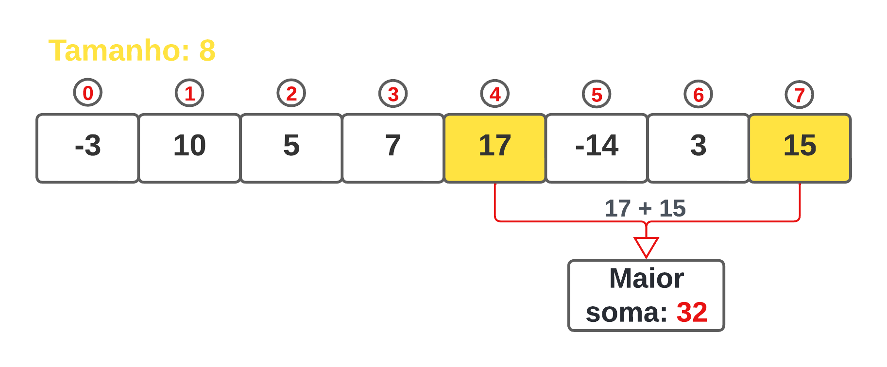
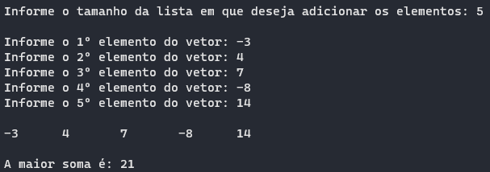
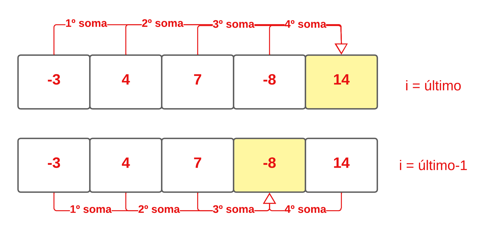

# Exercício de Tipo Abstrato de Dados Lista - Exercício 4

<h1> A máxima soma

## Conteúdos

 <a href="#apresentação">Apresentação</a> •
 <a href="#representação-gráfica-do-problema-da-máxima-soma">Representação gráfica do problema da máxima soma</a> •
 <a href="#lógica">Lógica</a> • 
 <a href="#representação-gráfica">Representação gráfica</a> • 
 <a href="#compilação-e-execução">Compilação e Execução</a> • 
 <a href="#autor">Autor</a>

---

## Apresentação

Foi proposto pelo professor [Michel Pires da Silva](http://lattes.cnpq.br/1449902596670082) da matéria de `Arquitetura e Estruturas de Dados 1 do 3º Período do curso de Engenharia da Computação` 4 diferentes exercícios relacionados a Tipo Abstrato de Dados Lista, com o objetivo de praticar e adquirir experiencia com esse TAD e seus métodos. O exercício de número 4 foi resolvido utilizando o tipo `Lista Linear` e seus métodos padrões para solucionar o problema proposto no qual tinha o objetivo de encontrar a máxima soma dentro de um conjunto de elementos inteiros, sendo eles positivos ou não, com isso fiz uma tentativa em que obtive êxito para a solução deste problema!

## Representação gráfica do problema da máxima soma
Calculo da máxima soma do vetor onde o tamanho e seus valores foram fornecidos pelo usuário:

 

---

## Lógica

Ao tentar pensar em diversas formas de resolver o problema proposto de forma em que há uma boa estruturação de código e um bom custo computacional, foi então pensado em várias etapas até chegar na solução final e encontrar a soma máxima nos vetores.
A primeira etapa a ser pensada foi no método de entrada do programa em que consistiu em o usuário inserir a entrada, com 
isso o vetor da lista se tornou um ponteiro na qual foi alocado na função `FLVazia` e com isso então foi permitido o usuário alocar quantos vetores quiser para ser feita a inserção dos valores dentro desses vetores.
A segunda etapa foi em pensar em como achar a máxima do vetor, foi pensado então em pegar o primeiro elemento do vetor e ir somando com o último, o segundo e somar com o ultimo e assim vai até chegar no final do vetor, chegando no final a última posição sendo **i** irá andar uma posição para frente, ou seja, irá para o penúltimo e assim será feita a soma do primeiro com o penúltimo até chegar no final, após isso irá ser feito a mesma coisa com a posição **i** até chegar no início do vetor, sempre que são feitas as somas elas são armazenadas em uma variável e com isso é feita a verificação com uma variável chamada _maior_ olhando se essa soma é maior que outro já somada, lembrando que, nunca será feita uma soma com as mesmas posições do vetor pois após ser feito dois `FORs` (onde o primeiro que é o de **i** onde ele iniciará no último e irá andando de trás pra frente e o segundo que o de **j** que irá começar da primeira posição e irá andar até o ultimo) existe um `IF` onde só permitirá a soma se as posições forem diferentes.
A terceira etapa foi tentar pensar em como seria feita a verificação de qual soma seria a nova soma maior, ou seja, como verificar a maior soma após ser feita a mesma. Então foi implementada essa solução da seguinte forma, foi feito um _count_ onde somará mais um no final de cada soma então na primeira vez esse _count_ iria ser 0, sendo a primeira soma, verificando se o contador fosse 0 a variável soma seria a nova variável _maior_ pois seria a primeira soma feita, já após a segunda soma iria ser verificado se a soma fosse maior que a soma armazenada na variável _maior_ ela seria a nova maior soma, caso contrário a maior soma se manteria a mesma.
A última etapa foi pensar em como poderia ser feita a impressão da soma maior verificando se realmente todos os números foram somados, com isso foi pensado então em pegar o número do contador onde contabiliza cada soma e verificar se é igual ao número de possibilidades da soma de todos os elementos e assim então imprimir a máxima soma, concluindo então a solução de encontrar a máxima soma de vetores;

---

## Representação gráfica

Segue a representação gráfica de um exemplo de um vetor de tamanho 5 dado pela execução do programa e a máxima soma desses vetores:

    A representação acima no diagrama demonstra apenas uma parte de como o programa irá rodar, pois o i irá ser reduzido até chegar na primeira posição fazendo a soma com todos e achando a maior soma.

---

## Compilação e Execução

O programa feito de acordo com a proposta possui um arquivo Makefile que realiza todo o procedimento de compilação e execução. Para tanto, temos as seguintes diretrizes de execução:

| Comando                |  Função                                                                                           |                     
| -----------------------| ------------------------------------------------------------------------------------------------- |
|  `make clean`          | Apaga a última compilação realizada contida na pasta build                                        |
|  `make`                | Executa a compilação do programa utilizando o gcc, e o resultado vai para a pasta build           |
|  `make run`            | Executa o programa da pasta build após a realização da compilação             

---

## Autor

Criado por [Pedro Henrique Louback Campos](https://www.linkedin.com/in/pedro-henrique-louback-campos-0a4a03205/)

Aluno do 3° periodo do curso de `Engenharia da Computação` no [CEFET-MG](https://www.cefetmg.br)